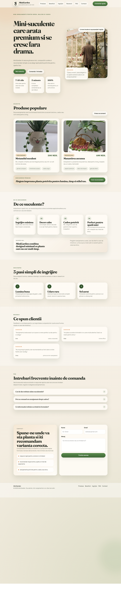
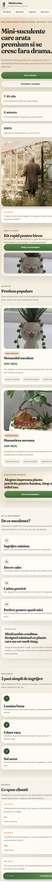

# MiniGarden Landing Page

MiniGarden is a lab landing page for a small succulent shop. The page focuses on a clear hero section, strong call to action, product highlights, social proof, FAQ, and a contact form, all built with plain HTML and CSS.

## Live demo

- GitHub Pages: https://georgerabus.github.io/tum-web-lab2/

## Topic

- Premium-looking succulent arrangements for home desks, balconies, and gifts

## Tech stack

- `index.html`
- `reset.css`
- `style.css`
- No CSS frameworks or JavaScript libraries

## Sections included

- Sticky navigation
- Hero with primary CTA
- Popular products
- Benefits
- Care guide
- Testimonials
- FAQ
- Contact form

## Screenshots

### Desktop

### Mobile

## Deployment

The project is deployed on GitHub Pages from this repository.
